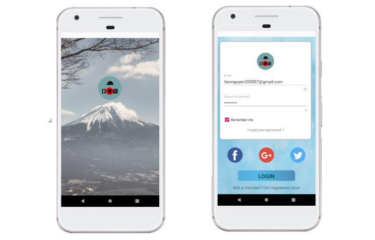
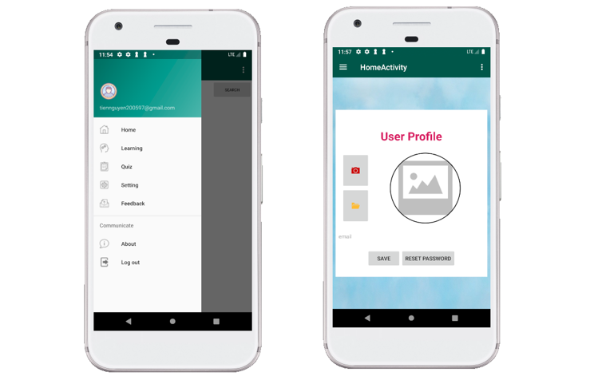
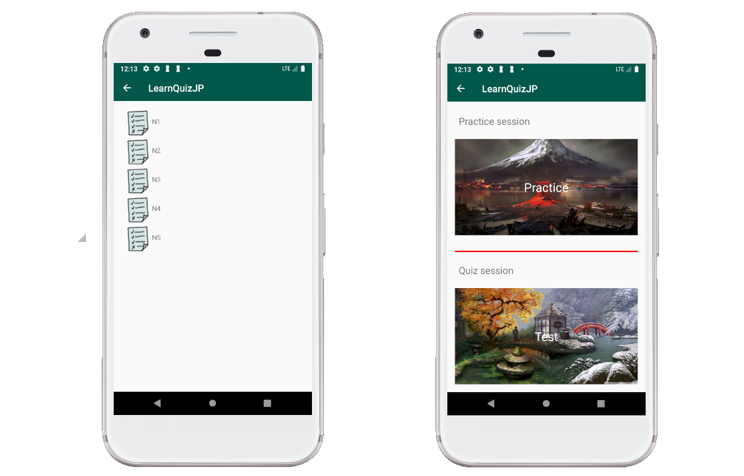
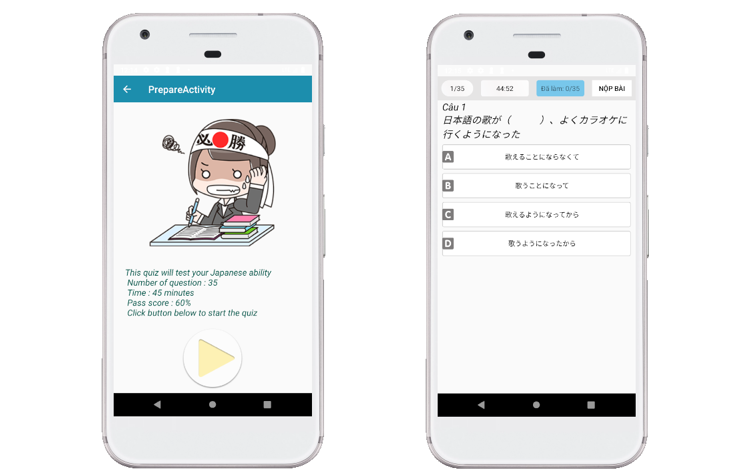
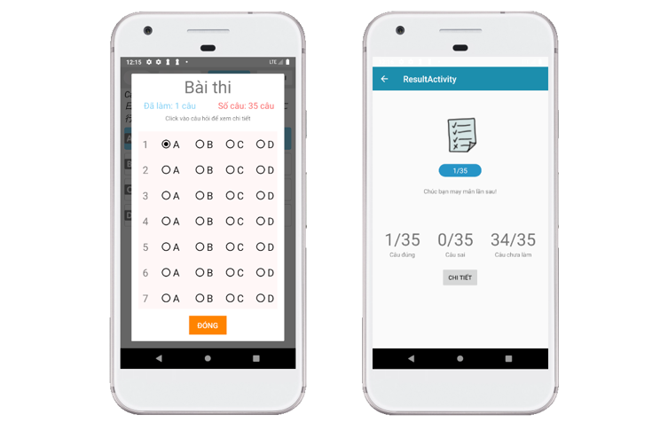
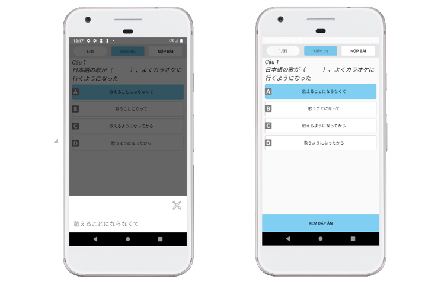

#LearnQuizJP
- Android Apps 
- Kotlin
- Firebase
- SQlite

## Screenshots,App preview

### Welcome screen & Login

### Home screen

### Quiz screen 

### Quiz start scree 

### Quiz status screen

### Quiz detail & answer screen

## Libraries/tools

This project uses libraries and tools like:
- facebook-android-sdk:4.42.0 [facebook-android-sdk](https://developers.facebook.com/docs/)
- [firebase](https://firebase.google.com) core auth database
- [gson](https://github.com/google/gson)

# How to build/run the projects

- open project in android studyo and start

Congratulations! You've just successfully run the project as a Android app

